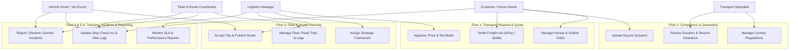

# Use Case Diagram

The system connects five operational actors across core Flows 1–4 and optional Flows 5–6 as defined in `docs/requirements.md`.

```mermaid
flowchart TB
  Customer["Customer / Horse Owner"]
  Manager["Logistics Manager"]
  Specialist["Transport Specialist"]
  Coordinator["Fleet & Route Coordinator"]
  Driver["Vehicle Driver / Vet Escort"]

  subgraph F1["Flow 1: Transport Request & Quote"]
    UC1["Manage Horses & Submit Order"]
    UC2["Approve, Price & Set Mode"]
    UC3["Settle Freight via SePay / MoMo"]
  end

  subgraph F2["Flow 2: Compliance & Quarantine"]
    UC4["Manage Country Regulations"]
    UC5["Upload Equine Dossiers"]
    UC6["Review Dossiers & Record Clearance"]
  end

  subgraph F3["Flow 3: Fleet & Route Planning"]
    UC7["Assign Strategic Framework"]
    UC8["Manage Fleet, Road Trips & Legs"]
    UC9["Accept Trip & Publish Route"]
  end

  subgraph F4["Flow 4 & 5-6: Tracking, Incidents & Reporting"]
    UC10["Update Stop Check-ins & Vital Logs"]
    UC11["Report / Resolve Corridor Incidents"]
    UC12["Monitor SLA & Performance Reports"]
  end

  Customer --> UC1
  Customer --> UC5
  Customer --> UC3
  Customer --> UC10

  Manager --> UC2
  Manager --> UC7
  Manager --> UC9
  Manager --> UC12

  Specialist --> UC4
  Specialist --> UC6

  Coordinator --> UC8
  Coordinator --> UC11
  Coordinator --> UC10

  Driver --> UC9
  Driver --> UC10
  Driver --> UC11
```
